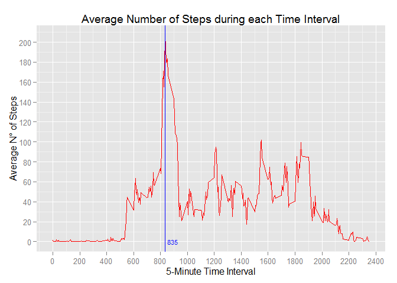
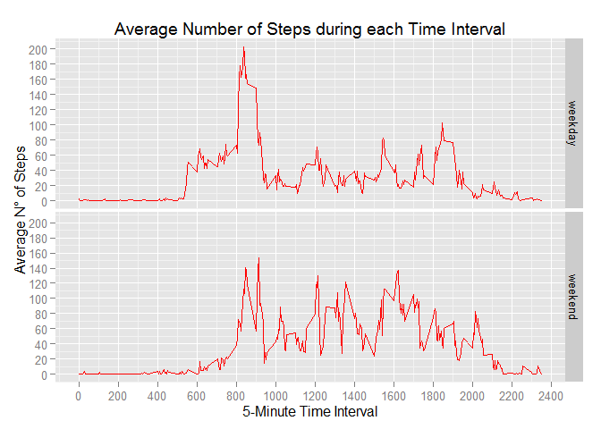

# Reproducible Research Peer Assessment 1
Saturday, August 15, 2015  

R libraries used:

```r
library(knitr)
library(data.table)
library(dplyr)
library(ggplot2)
```


Download raw data, unzip, and load into two data tables, one with missing values and the other without:

```r
# download.file("https://d396qusza40orc.cloudfront.net/repdata/data/activity.zip", "activity.zip") # Only do once; hence commented out.
# unzip("activity.zip") # Only do once; hence commented out.
dtna = fread("activity.csv")  # Data table with missing data (NA) included.
dt = dtna[complete.cases(dtna),]  # Data table with complete rows only.
dtna$date = as.Date(dtna$date)
dt$date = as.Date(dt$date)
```

Calculate mean total number of steps taken per day, and plot histogram:

```r
spd = summarise(group_by(dt, date), sum(steps))  # Total number of steps per day.
setnames(spd, names(spd)[2], "steps")
g = ggplot(spd, aes(steps))
g = g + geom_histogram(binwidth=3000, fill="red")
g = g + ggtitle("Histogram of Total Number of Steps per Day")
g = g + xlab("N° of Steps") + ylab("Frequency")
g = g + scale_x_continuous(breaks=c(seq(0, 25000, 5000)))
g
```

 

Calculate mean and median:

```r
table = data.table(Mean=0, Median=0)
table$Mean = mean(spd$steps)
table$Median = median(spd$steps)
print(table, row.names=F)
```

```
##      Mean Median
##  10766.19  10765
```

Calculate average daily activity pattern and plot graph:

```r
# Create data table with average steps per interval:
spi = summarise(group_by(dt, interval), mean(steps))  # Average number of steps per 5-minute interval.
setnames(spi, names(spi)[2], "steps")

# Calculate interval at which maximum number of steps occurs:
ms = max(spi$steps)
sm = subset(spi, spi$steps==ms)
mi = sm$interval

# Plot graph:
g = ggplot(spi, aes(x=interval, y=steps))
g = g + geom_line(colour="red")
g = g + ggtitle("Average Number of Steps during each Time Interval")
g = g + xlab("5-Minute Time Interval") + ylab("Average N° of Steps")
g = g + scale_x_continuous(breaks=c(seq(0, 2600, 200)))
g = g + scale_y_continuous(breaks=c(seq(0, 220, 20)))
g = g + geom_vline(xintercept=mi, colour="blue")
g = g + annotate("text", x=mi+55, y=0, label=mi, colour="blue", size=3)
g
```

 

The 5-minute interval that contains the maximum number of steps is interval n° 835.

The total number of missing values in the dataset is 2304.

Create new dataset equal to original dataset but with the missing data filled in. Use the mean number of steps per interval (in data table spi) to fill in the missing data. Create a new histogram based on this new dataset, and calculate the mean and the median:

```r
# Create new dataset with the missing data filled in:
setkey(dtna, interval)
setkey(spi, interval)
dtnaf = merge(dtna, spi)
setnames(dtnaf, names(dtnaf)[2], "steps")
dtnaf$steps = as.numeric(dtnaf$steps)
dtnaf$steps[is.na(dtnaf$steps)] = dtnaf$steps.y
dtnaf$steps.y = NULL

# Create new histogram based on new filled-in dataset:
spdf = summarise(group_by(dtnaf, date), sum(steps))  # Total number of steps per day.
setnames(spdf, names(spdf)[2], "steps")
g = ggplot(spdf, aes(steps))
g = g + geom_histogram(binwidth=3000, fill="red")
g = g + ggtitle("Histogram of Total Number of Steps per Day")
g = g + xlab("N° of Steps") + ylab("Frequency")
g = g + scale_x_continuous(breaks=c(seq(0, 25000, 5000)))
g
```

 

Calculate mean and median for filled-in dataset:

```r
table = data.table(Mean=0, Median=0)
table$Mean = mean(spdf$steps)
table$Median = median(spdf$steps)
print(table, row.names=F)
```

```
##      Mean Median
##  9371.437  10395
```

We observe that the mean and median for the filled-in dataset are significantly different from the values for the dataset with missing values eliminated.

In addition the histogram for the filled-in data set is also significantly different. In particular, the frequency for the minimum number of steps increases notoriously so that the histogram becomes skewed and deviates significantly from a normal distribution.

Create a new factor variable in the filled-in dataset with two levels: "weekday" and "weekend", and make a panel plot with a panel for each type of week day.

```r
# Create new factor variable wk_wkend.
dtnaf$wk_wkend[wday(dtnaf$date)>=2 & wday(dtnaf$date)<=6] = "weekday"
dtnaf$wk_wkend[wday(dtnaf$date)==1 | wday(dtnaf$date)==7] = "weekend"
dtnaf$wk_wkend = as.factor(dtnaf$wk_wkend)

# Create data table with average steps per interval per day type:
spid = summarise(group_by(dtnaf, interval, wk_wkend), mean(steps))  # Average number of steps per interval, per wk_wkend.
setnames(spid, names(spid)[3], "steps")

# Plot panel graph:
g = ggplot(spid, aes(x=interval, y=steps))
g = g + geom_line(colour="red")
g = g + facet_grid(wk_wkend ~ .)
g = g + ggtitle("Average Number of Steps during each Time Interval")
g = g + xlab("5-Minute Time Interval") + ylab("Average N° of Steps")
g = g + scale_x_continuous(breaks=c(seq(0, 2600, 200)))
g = g + scale_y_continuous(breaks=c(seq(0, 220, 20)))
g
```

 
